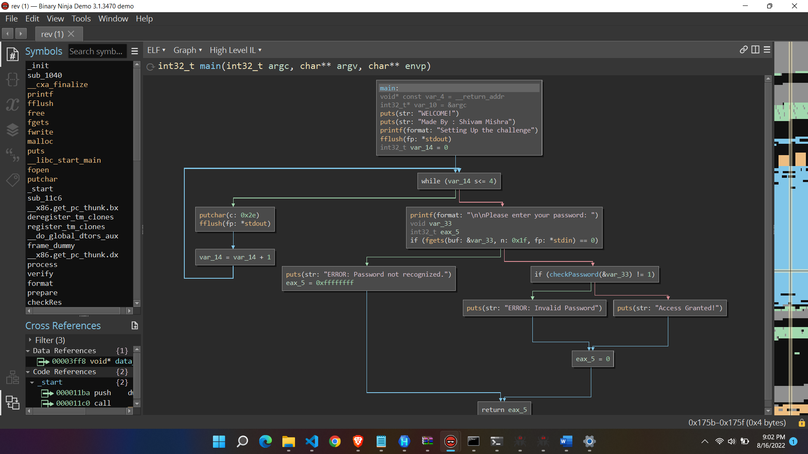

# Reverse Engineering
### i have tried to crack the password but not sure about it, i also tried to convert it into hex but got the final results as shown below:-
* club
* pclub
* secy
* 2022
* ...
* ....
* CLoneTable

---
### i first used a hex workshop and convert the binary file which is of ELF type and it gets converted into hex format then I carefully anaylse the patterns and the strings that are forming I also tried to get its linear map and converted back into C lang. also, but then due to time constraints I could'nt arrived at a final conclusion, but this task helped me to understand what reverse engineering is and what did they do. They usually perform there task on linux .
---
## Here is the hex code of the rev file provided.

.ELF........................4
...p:......4. ...(.........4...4...4...................................................................T...T...........................4...4................ ... ... ..t...t....................>...>..X...\....................>...>..................................`...`...........S.td............................P.td.!...!...!..................Q.td............................R.td.....>...>..P...P.........../lib/ld-linux.so.2..............GNU....9....$.f.B..S>.fV............GNU.........................GNU.................................. . .........K.............................. ...:...............................}...............A...............\..........."...U...............N...............'........................... ...k...............4...............!...............,...............G........................... ........ ...........libc.so.6._IO_stdin_used.fflush.fopen.puts.putchar.stdin.printf.fgets.stdout.malloc.fwrite.__cxa_finalize.__libc_start_main.free.GLIBC_2.1.GLIBC_2.1.3.GLIBC_2.0._ITM_deregisterTMCloneTable.__gmon_start__._ITM_registerTMCloneTable.......................................................ii.............s.i..............ii..............>.......>.......?.......@.......?.......?.......?.......?.......?.......?.......?.......?.......?.......?.......?.......?.......?.......?.......?.......?......................................................................................................................................................................................................................................................................................................................................................................................................................................................................................................................................................................................................................................................................................................................................................................................................................................................................................................................................................................................................................................................................................................................................................................................................................................................................................................................................................................................................................................................................................................................................................................................................................................................................................................................................................................................................................................................................................................................................................................................................................................................................................................................................................................................................................................................................................................................................................................................................................................................................................................................................................................................................................................................................................................................................................................................................................................................S.........../....<.....t......[...........................@.....h.........f.....h.........f.....h.........f.....h.........f.....h ........f.....h(........f.....h0........f.....h8....r...f.....h@....b...f.....hH....R...f.......8...f..D............f..D............f..D............f..D............f..D............f..D........ ...f..D........$...f..D........(...f..D........,...f..D........0...f..D......1.^.....PTR."...........`...P......PQV..H...........$.f.f.f...$.f.f.f.f.f.f.........-....X.....X...9.t...4.....t.U.....Q........t&.....&............-..U..S..X.....X......).............t...L.....t....PQ......].....&....f.....U..S.S.....3-.......X....u'..8.....t......T....9.......1.....X.....]....t&.......W.....$.....U..S..........,...E........jx...K.........E....E........E....U.............E...}..~..E......C.E....U..............E.........E...........E.........E.......u..E...}..~....].......U...........#,...E......E......E........U..E......<-u..e...E...m...}..u..}.\u...................U..VS...........+...E........jx.:.......E..E......6.U..E..........E....U.........U....M...............E...}..~.....u...........e.[^].....U..S....Y.....9+...E..........p...P..r...P.........E..E...........U..E...........c.....................>...u.j.j...|...P.H.......w.u.j.j.......P.0......._.u.j.j.......P.........G.u.j.j.......P........./.u.j.j.......P...........u.j.j.......P..........E...}....:......].......U..WV....?.....&*....|.....................E......*.E....|....E.........E.....9.t.........E...}..~.........^_].....U...............)...E.......|........E......E......E......E......E......E......E......E......E......E......E......E......E......E......E......E......E......E......E......E......E......E......E......E......E......E......E......E......E..........x...P..|...P.u..............x...P.u..Z..........u..c.......E......x...P.u...........x......P.4.........u....................L$.....q.U..SQ..0.Z.....:(...........P.................P.................P.A........D........P.=.......E......%...j...........D........P.........E...}..~..........P..........@........Pj..E.P..........t<....E.P...........u..........P.........-.........P...................P.....................e.Y[].a....$.f.f.f.f.f.f.f.....U.k......'..WVS......|$(.?...............)....t)1...&.....v....W.t$,.t$,.............9.u....[^_]...&.....t&.......,$........S...........&.....[.............................................................................................................................................................................................................................................................................................................................................................................................................................................................................................................................................................................................................................................................................................................................................................................................................................................................................................................................................................................................................................................................................................................................................................................................................................................................................................................................................................................................................................................................................................................................................................................................................................................................................................................................................................................................................................................w./dev/null.Try.harder.comrade.you're.almost.there..%...........U.......................................................=...........................m.......................`...@...@.......8...........4.......@...............0............... ...b...............p.......@...........WELCOME!.Made By : Shivam Mishra.Setting Up the challenge.....Please enter your password: .Access Granted!.ERROR: Invalid Password..ERROR: Password not recognized.....;........T........................................... .......@.......h....................................... ...4...l...9................zR..|......................:....D.. ...0..............F..J..t.x.?.9*2$"....T...(...............h...$........... ...|............E....B..D..................z...`....E....B...X.....$................E....B..E.....z.A.A.... ................E....B..D..........$...........s....E....B..E.....d.A.A........4...T...o....E....B...g.....4...T.......3....H...I...u.B..ux....u|.......A.A.C..........................H...........e....E....L....A....A....C. m.$A.(D.,D.0M. G..A...A...A...A.................................................................................................................................................................................................................................................................................................................................................................................................................................................................................................................................................................................................................................................................................................................................................................................................................................................................................................................................................................................................................................................................................................................................................................................................................................................................................................................................................................................................................................................................................................................................................................................................................................................................................................................................................................................................................................................................................................................................................................................................................................................................................................................................................................................................................................................................................................................................................................................................................................................................................................................................................................................................................................................................................................................................................................................p................................>...............>.............o(.......h.......H................................?......P...............................P......................o.......ot......o.......oP......o.............................................>..........@...P...`...p...............................................[............@..GCC: (Ubuntu 9.4.0-1ubuntu1~20.04.1) 9.4.0......................................................................................(...............H...............h...............P...............t...............................................................0................................................................................ ...............!..............`"...............>...............>...............>...............?...............@...............@.............................................................. ...........!...p...........7....@..........F....>..........m...............y....>..............................M...............................................................................5...............................p$...............................>...............>...............>...............!...............?.........................."...............2.......o.......@........... ...\...............4....@...... ...r....................................................................................@..........,..........................................................."................... ...............2....@..........?...............O...y...s.......X........... ...g....@..........t.... ..............................................g...................e............................................................@..........8.......:............ ...............................@..............[...3.......................4...~...`.......;....@..........G........... ....crtstuff.c.deregister_tm_clones.__do_global_dtors_aux.completed.7623.__do_global_dtors_aux_fini_array_entry.frame_dummy.__frame_dummy_init_array_entry.chall.c..L19..L25..L24..L23..L22..L20.__FRAME_END__.__init_array_end._DYNAMIC.__init_array_start.__GNU_EH_FRAME_HDR._GLOBAL_OFFSET_TABLE_.__libc_csu_fini.checkPassword._ITM_deregisterTMCloneTable.__x86.get_pc_thunk.bx.printf@@GLIBC_2.0.fflush@@GLIBC_2.0.__x86.get_pc_thunk.bp.free@@GLIBC_2.0.fgets@@GLIBC_2.0._edata.__x86.get_pc_thunk.dx.process.__cxa_finalize@@GLIBC_2.1.3.fwrite@@GLIBC_2.0.malloc@@GLIBC_2.0.__data_start.puts@@GLIBC_2.0.checkRes.__gmon_start__.__dso_handle._IO_stdin_used.format.__libc_start_main@@GLIBC_2.0.prepare.__libc_csu_init.stdin@@GLIBC_2.0.fopen@@GLIBC_2.1.putchar@@GLIBC_2.0._fp_hw.stdout@@GLIBC_2.0.__bss_start.main.__x86.get_pc_thunk.ax.verify.__TMC_END__._ITM_registerTMCloneTable...symtab..strtab..shstrtab..interp..note.gnu.build-id..note.gnu.property..note.ABI-tag..gnu.hash..dynsym..dynstr..gnu.version..gnu.version_r..rel.dyn..rel.plt..init..plt.got..plt.sec..text..fini..rodata..eh_frame_hdr..eh_frame..init_array..fini_array..dynamic..data..bss..comment....................................................................................#...................$...................6.......................................I................... ...................W......o....(...(... ...................a...........H...H... ...................i...........h...h.......................q......o....P...P...$...................~......o....t...t...@.......................................P...........................B...........P.......................................$...............................0...0.................................................................................................................................................................................................... ... .............. ....................!...!..................................`"..`"...................................>.......................................>.......................................>.......................................?.../..P................................@...0...................................@...0..............................0........0..+...................................40..........4............................5..a...................................U9......................

---
---
---
### this a a sub part of the C-code that I reversed from the binary file:- 
00001766       void* const var_4 = __return_addr  
0000176d      int32_t* var_10 = &argc  
00001786      puts(str: "WELCOME!")  
00001798      puts(str: "Made By : Shivam Mishra")  
000017aa      printf(format: "Setting Up the challenge")  
000017be      fflush(fp: *stdout)  
000017f8      for (int32_t var_14 = 0; var_14 s<= 4; var_14 = var_14 + 1)  
000017d4          putchar(c: 0x2e)  
000017e8          fflush(fp: *stdout)  
00001804      printf(format: "\n\nPlease enter your password: ")  
00001828      void var_33  
00001828      int32_t eax_5  
00001828      if (fgets(buf: &var_33, n: 0x1f, fp: *stdin) == 0)  
00001870          puts(str: "ERROR: Password not recognized.")  
00001878          eax_5 = 0xffffffff  
00001831      else  
0000183c          if (checkPassword(&var_33) != 1)  
0000185c              puts(str: "ERROR: Invalid Password")  
00001848          else  
00001848              puts(str: "Access Granted!")  
0000187f          eax_5 = 0  
0000188d      return eax_5  

---
---
---
## The following would be the image of the algo. map of the C-program 

### That's all from my side chief, at least I tried and get the following results which helped me to learn many new things out of the box.
### THank you team pclub!!

